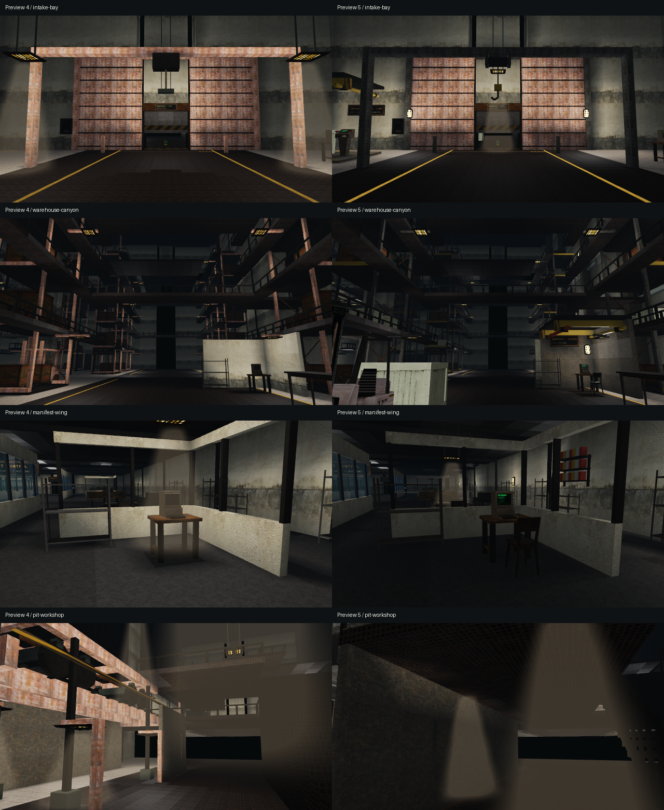
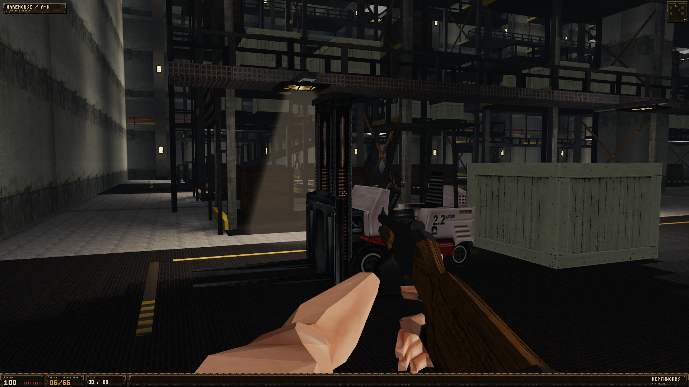

# Freight reference pass — preview 5

The scene targets were the supplied industrial corridor, forklift and control-equipment reference images. The pass addresses their actual construction: confined personnel spaces beside tall freight halls, attached services, caged warm lights, usable operator clearance, connected structural members and recognizable equipment. These are native Vulkan game renders, not generated concept images.

## Shared engine changes

Wall fixtures are ordinary `WorldLight` records. Their backing, outward emitter, optical source, color/material shading and static cached geometry use the same system in campaign and custom maps. Ceiling light defaults remain compatible.

Open stair treads and optional guards are generated by `World::buildLayers`. They use the same structures for movement collision, light occlusion and rendering. Regression checks cover under-stair passage, legacy solid stairs and guards that block side falls while leaving the flight clear. Industrial stringers remain ordinary authored pipework.

GPU atlas identity no longer depends on an allocation address. Copying a texture creates a fresh generation; moving it transfers the generation. The material cache and its fast path compare that identity. A deterministic GPU regression recycles the same pixel allocation with different emission and normal data and verifies the new material. Uploaded atlases remain immutable except explicit dynamic color updates.

Emission is decoded before upload and filtered in linear radiance through every mip. Odd edge rows and columns contribute to all levels. Tests check every level, half precision, bilinear intensity and phase-independent minification. GGX, mirrored UVs, close-surface parallax, physical static normals and cached/reference rendering remain checked.

Normal derivation decodes each source luminance once instead of repeating gamma conversion for every neighbor. Equal-height ceilings coalesce into exactly the same solid union. We reject noncompetitive light candidates before an optical ray when visibility could only reduce their weight. These changes preserve the lighting calculations; they do not lower render resolution or remove effects.

## Evidence and limits

Matching-camera comparisons use the prior preview 4 executable and the final preview 5 executable. Fixed environment views use identical 640x360 output and camera coordinates; material comparisons use native 1920x1080 Vulkan output. Newly added detail cameras are inspected separately and are not presented as matched before/after pairs. The warehouse arrival facing changes in gameplay, while its existing straight-axis comparison camera remains unchanged.

Performance uses the native 1920x1080 Win32 swapchain on an RTX 5060 Ti, HDR and 4x MSAA, 30 warmup frames and 120 measured frames per freight scene. Initial static construction is reported separately. Short samples are affected by scheduling and cannot establish GTX 1660 performance or a broad speed claim. No GTX 1660 or Windows 10 test machine is available, and the VR headset is disconnected.

The revised corridor and pit are substantially more coherent. Warehouse shape, repetitive broad intake panels and parts of the transfer/cradle brief still need further authored work. This release does not claim parity with another game or completion of every freight design requirement.

## Final validation

The final executable is **23,312,384 bytes** against the 25,000,000-byte limit. All **185 embedded resources** match their source RGBA pixels/dimensions or byte-identical model/audio/animation data. SHA-256: `2fa32f2995909bd58629d58b7e7a903cd0b82acb601ae5474551884b15f4a738`.

World isolation, campaign map traversal, Vulkan material/cache shading, streaming, save, service maps, campaign extension, offline VR, editor payload exports and hardware smoke checks pass. The final binary also passes the Windows x64 manifest/runtime dependency audit; that is not a test on Windows 10 hardware. Repeated fixed-camera renders and door/movement benchmarks record **zero static map rebuilds**.

| Scene | Preview 4 FPS | Preview 5 FPS | First render before / after (ms) |
| --- | ---: | ---: | ---: |
| RECEIVING OVERLOOK | 128.0 | 115.4 | 328 / 375 |
| RECEIVING LANES | 144.5 | 148.2 | 43 / 45 |
| WAREHOUSE / A-B | 140.4 | 136.7 | 1793 / 1677 |
| MANIFEST OFFICES | 168.0 | 157.6 | 322 / 212 |
| EMPTY PLATFORM | 179.4 | 163.5 | 121 / 155 |
| DEPOT / TRACKSIDE | 157.9 | 153.1 | 654 / 697 |
| DEPOT / INSPECTION PITS | 170.5 | 165.4 | 188 / 223 |
| DEPOT / GANTRIES | 180.0 | 167.5 | 453 / 318 |

Added construction does not produce an overall speed improvement in these short samples. Cold warehouse construction still takes about 1.68 seconds; this is an outstanding hitch, separate from warmed frame throughput. Door samples range from 140.2 to 169.4 FPS with no static cache rebuilds. [Freight timings](freight-reference-pass/freight-performance-window.txt), [door timings](freight-reference-pass/door-performance-window.txt) and [final binary checks](freight-reference-pass/release-validation.txt) contain the raw measurements.

[All 31 matching-camera pixel comparisons](freight-reference-pass/pixel-comparison.txt) use absolute RGB differences. The percentages measure changed pixels and colors; they do not measure aesthetic quality. New equipment/detail cameras are omitted from the matched comparisons.

The complete source forklift is shown below in a native 1920x1080 game frame. Its original eight material atlases, mast, forks and tyres are preserved. This is an actual game capture.

