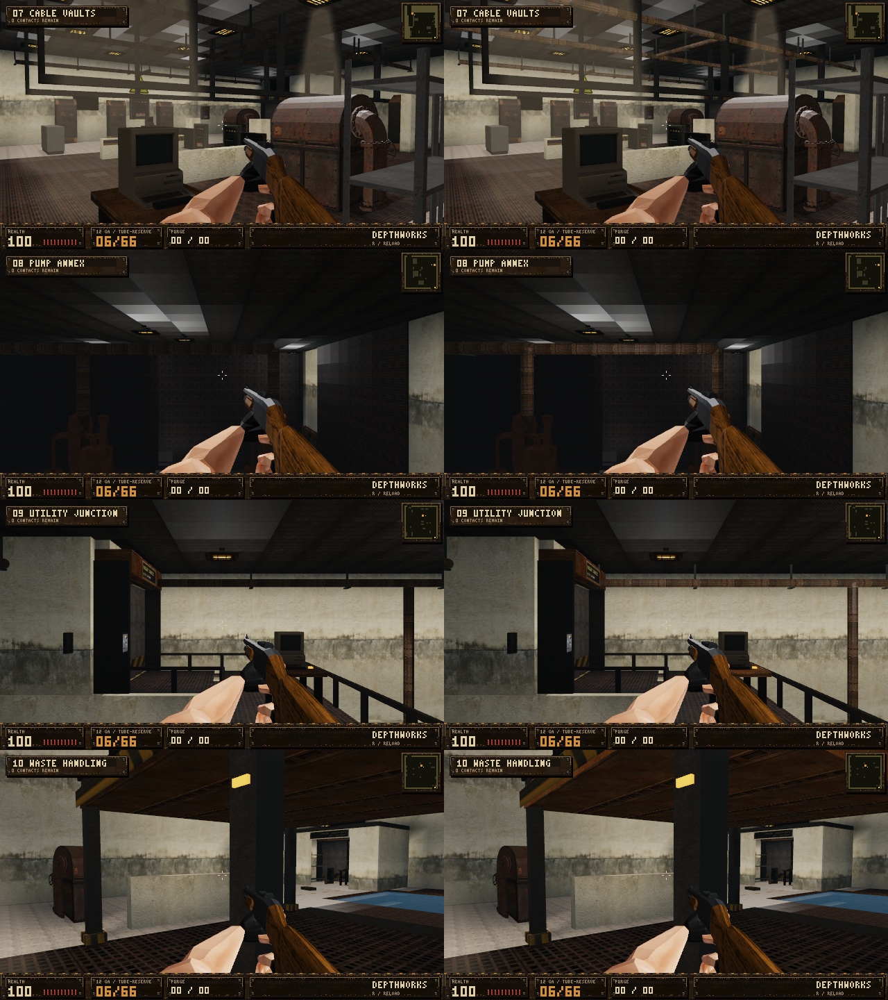

# Performance without reducing rendering quality

v0.6.5 targets repeated CPU work and frame-time spikes while retaining the
existing Vulkan rendering settings. Stationary service pipework is cached;
the collision engine uses conservative spatial candidates followed by the
original exact tests; the arm rig skins once after its final pose. Surface
capabilities are queried on window changes. All material maps and scene/composite
shaders are unchanged.

## Validation conditions

Windows 11 Pro, NVIDIA RTX 5060 Ti, native 1920x1080 Win32 swapchain,
linear HDR and 4x MSAA. Window tests use 30 warmup frames and 120 measured
frames per scene. Warm performance excludes asset preparation and static-cache
construction; the updated benchmark reports first-render cost separately.
Background tasks and driver scheduling affect these short measurements.
There is no GTX 1660 hardware or Windows 10 machine in this test environment.

## Measured frame times

Median of three runs against the published v0.6.4 executable. Lower p95 frame
time means fewer slow frames; this is measured wall-clock time, not a GPU timer.

| Scene | FPS before | FPS after | p95 before (ms) | p95 after (ms) |
| --- | ---: | ---: | ---: | ---: |
| Foundry turn | 120.6 | 128.5 | 9.60 | 9.09 |
| Gantry turn | 140.7 | 156.1 | 8.75 | 8.09 |
| Ashfall terrain + streaming | 102.9 | 103.0 | 13.92 | 14.72 |
| Lift entry turn | 141.4 | 153.4 | 8.18 | 8.01 |
| Hazmat settling | 121.0 | 134.8 | 9.79 | 8.76 |
| Ascent window | 142.6 | 162.4 | 8.19 | 7.19 |
| Reactor balcony turn | 140.3 | 154.2 | 8.66 | 7.31 |
| Reactor active AI | 134.4 | 152.1 | 8.75 | 8.03 |
| Cable Vaults | 58.9 | 161.0 | 58.40 | 7.34 |
| Pump Annex | 100.0 | 144.9 | 18.73 | 8.94 |
| Utility Junction | 138.5 | 159.3 | 8.81 | 7.59 |
| Waste Handling | 88.3 | 146.6 | 36.90 | 9.90 |

Ashfall average throughput is unchanged, but p95 is 5.8% worse in these runs.
The patch does not demonstrate an improvement in that terrain/streaming case.

[Machine-readable comparison](performance-quality/benchmark-comparison.json).
Raw runs: [before 1](performance-quality/before-run-1.txt),
[2](performance-quality/before-run-2.txt), [3](performance-quality/before-run-3.txt);
[after 1](performance-quality/after-run-1.txt),
[2](performance-quality/after-run-2.txt), [3](performance-quality/after-run-3.txt).

## Quality checks

- Six arm poses compare final vertices, UVs and hand transforms **exactly**
  against the original redundant-skinning calculation.
- Ten maps and rotated fixture boundaries compare spatial collision results,
  support heights and support-below heights **exactly** against full scans.
- Four service maps compare cached and uncached pipework with sufficient
  lighting budget: zero pixels differ by more than 4/255 in the 128x72 regression.
- Fixed-camera high-resolution and campaign images compare against v0.6.4.
  Changes are principally pipe lighting that was missing in the original
  limited-budget path. Pixel differences are change evidence, not quality scores.
- Vulkan materials, physical normals, GGX, alpha/depth, near clipping,
  viewmodel attachment, parallax and cached/fresh geometry checks remain active.
- Resize and minimize/restore tests verify continued hardware presentation.

## Remaining limits

Static geometry and lighting still have a first-build cost. This patch does not
claim to eliminate every streaming stall, provide ray tracing or add new
reflection/GI systems. The rendering model retains its existing limits.
Performance results on this GPU cannot establish an FPS target for the GTX 1660.

## Fixed-camera images

31 matching cameras were captured with the actual Vulkan renderer. Twenty have
zero pixels changing by more than 4/255 in any RGB channel. The other eleven
show corrected pipe lighting; no render-resolution change was used. The cached
pipework regression separately matches an uncached reference with a sufficient
lighting budget. Final arm poses and collision results match their references.

[Pixel counts and mean channel errors](performance-quality/pixel-comparison.json)
include five 1920x1080 views and 26 campaign views at 640x360. The image below
shows v0.6.4 on the left and v0.6.5 on the right: Cable Vaults, Pump Annex,
Utility Junction and Waste Handling. Visual inspection confirms that pipes
previously rendered black now receive their material lighting.

The Vulkan regression, broad smoke suite, presentation resize/minimize/restore,
six door-motion scenes and eight freight scenes passed. Door and freight motion
reported zero static-map rebuilds. Windows manifest/dependency checks and all
166 lossless embedded-asset checks passed. Executable size is 21,992,448 bytes,
below the 22,000,000-byte ceiling.

The first-render bake in Waste Handling still takes about 1.4 seconds locally.
It fell from 4.5 seconds in an intermediate build after the spatial collision
optimization; the old release benchmark did not separately record this cost.
It remains a loading/streaming issue for future work, excluded from the warm
frame-time table above.
