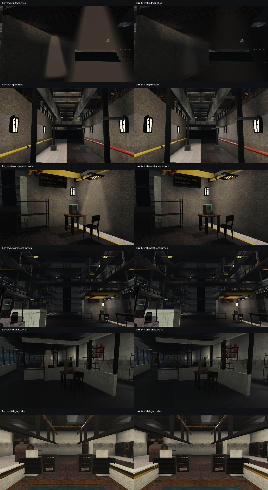
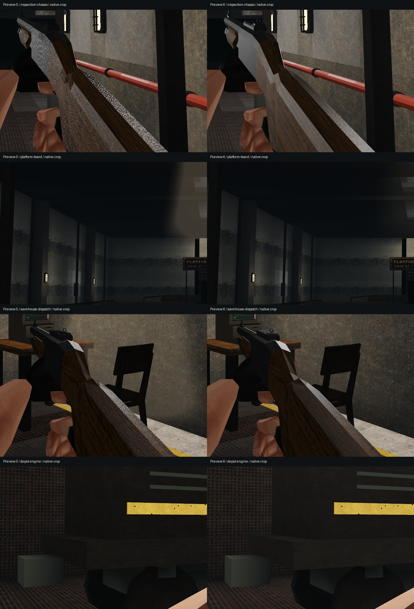

# Rendering and performance pass — preview 6

This pass changes the shared Vulkan renderer and CPU scene preparation. Campaign
layouts and assets are unchanged. The initial performance-only build matched all
38 fixed-camera preview 5 images exactly, including every RGB channel. The final
quality changes are evaluated separately; pixel differences measure changed
output, not a score for visual quality.

## Rendering corrections

Diffuse atlas texels decode through an sRGB image before bilinear, trilinear and
anisotropic filtering. GPU mip generation averages linear radiance with exact
area coverage, including odd-sized atlas borders, then stores encoded sRGB.
Level zero retains the original source bytes. Alpha stays linear. Additive
textures retain their original UNORM treatment. This follows the Vulkan
[texture sampling rules](https://docs.vulkan.org/spec/latest/chapters/textures.html).

Normal atlases store unnormalized first moments through all mip reductions and
hardware filtering. The shader reconstructs the mean direction and uses its
length to account for unresolved variance in GGX roughness. Renormalizing each
intermediate mean previously biased deeper mip directions, and using only the
old mip alpha missed variation introduced by bilinear filtering. Tiny UV spans
use a relative degeneracy test; Gram–Schmidt removes skew from the tangent basis
without reversing mirrored UVs. The material reasoning is informed by Filament's
[PBR treatment](https://google.github.io/filament/Filament.md.html).

Ceiling shafts now use the existing medium density inside exponential
extinction, and each authored lamp intensity controls scattered radiance.
Cylinder and height intersections bound the integration, including rays looking
straight along a light. A smooth shoulder replaces the old hard plateau. View
ray calculations are shared between lamps; unnecessary sine-based dust noise is
removed. The medium model is an inexpensive approximation, informed by
[PBRT's homogeneous media](https://pbr-book.org/3ed-2018/Volume_Scattering/Media).
It is not a full volumetric shadow map or global illumination system.

Four exact lamp powers extend the existing projection uniform buffer from 80 to
96 bytes. The push constants remain 128 bytes and the shaders still target
Vulkan 1.0. PC and VR use the same material and scattering logic.

## Performance changes

Immutable atlas payloads move into a queue with a 16 MiB batch target. A completed
mapped staging buffer is reused across uploads; each batch records transitions
and mip copies together and performs one transfer submission/fence completion.
A single larger image flushes independently. Draws, dynamic updates and VR eye
capture flush pending initialization before using the image. Teardown preserves
queued resources through completion. No source resolution, geometry, shadow
sampling, MSAA or render scale is reduced.

CPU scene preparation reuses exact light positions/shadow samples, resolves
fixture material parts once per model, and avoids unused triangle calculations.
The 38-view pixel-identical experiment isolates these optimizations from the
subsequent material and atmosphere corrections.

Fixed ceiling fixtures and their support rods now reuse world-space geometry
through the existing cache. Moving lights stay dynamic. Exact authored light
fields and actual support endpoints invalidate the cache when they change;
lighting probes and light bins refresh before rebuilding. Cached fixtures use
the architecture shader's per-vertex flashlight/muzzle response instead of the
old per-object centroid approximation. Zero-power opaque materials skip an
unused tangent frame; transparent water keeps it for Fresnel. Authored normals
also skip a geometric normalization whose result was discarded.

Switching a chunk between neighbor and active roles preserves its valid lighting
samples when those sources are unchanged. This avoids darkening existing pump
highlights and gantry walls through unnecessary invalidation. The final
[66-frame cache comparison](render-quality-pass6/final-cache-pixels.txt) checks
this addition against the quality build before ceiling caching; the gantry view
matches exactly.

Mip encoding uses a lookup table with exact floating-point rounding boundaries
instead of calling `pow` for every channel. The retained slow encoder remains
the regression reference. All 159 loaded non-additive atlases produced identical
bytes across 24,461,829 mip channels: 177.152 ms with the lookup versus 337.188 ms
with the reference, about 1.90 times faster in that test. This measures encoding,
not gameplay FPS. Both output hashes were `862865848526465126`.

Native window benchmarks report renderer asset construction and hardware
preparation separately from first-frame cache construction and warmed throughput.
This avoids concealing upload time in preparation outside the old first-render
measurement. Historical first-render values remain comparable to that same field;
the new total startup field has no equivalent in the old executable.

## Final evidence

The final executable is **23,360,000 bytes** (23.36 decimal MB), below the strict
28,000,000-byte limit. Its SHA-256 is
`910472ce728e0ca87421d31be8220119a4d0f83d50320f39b7c3f7e21a133a23`.
The release build verified all 185 embedded resources against source: exact
decoded RGBA dimensions/pixels and byte-identical models, audio and animation.

The 66 matched before/after views comprise 38 environment views at 640x360 and
28 detail/shading views at native 1920x1080. Neither comparison adjusts exposure
or sharpens the images. The native gun receiver loses dense white highlight
speckle in favor of broader gray reflections. Platform, Manifest and depot
structure is visible through the corrected scattering instead of opaque beige
curtains. Wood, skin, fixture mounts and physical contact structure remain intact.
Dark steel and distant passages, repeated grates/concrete and opaque train
windows remain visible limitations. These captures do not prove temporal
stability, player satisfaction or parity with another game's renderer.

The Vulkan regression suite passed real hardware sampling, diffuse radiance,
normal cancellation/skew/mirroring, power/density/vertical shafts, cached versus
reference rendering, dynamic distant wrist-screen mips, and batched/immediate
pixel equality. Its 32-image upload case used one grouped submission versus
eight immediate submissions; warmed reuse performed zero transfers. Final
world isolation, campaign, streaming, save, service-map, extension, offline VR,
hardware smoke and editor payload checks also passed.

The compatibility audit passed x64, the embedded Windows 10/11 manifest and
runtime DLL checks. It does not substitute for a Windows 10 runtime playtest.
GTX 1660 and live SteamVR hardware performance remain untested in this pass.

### Native performance measurements

Benchmarks use the RTX 5060 Ti, 1920x1080, linear HDR, 4x MSAA and the same
8x anisotropy, geometry and shadow queries. Each scene warms for 30 frames and
measures 120 frames. Door cycling measures 240 frames after the same warmup,
with a fixed camera and no AI. Every measured scene and door cycle had zero
static map rebuilds. Door cycles measured 134.2–163.8 FPS; these timings do not
include the cold cache builds.

Final startup instrumentation reported 1,516.51 ms constructing renderer assets,
1,421.60 ms preparing hardware and 409.85 ms for the first Receiving frame:
3,347.96 ms combined. The first frame's cumulative uploads were 200 images,
12 submissions, two staging allocations and 206,324,400 payload bytes. Across
all eight scenes that reached 237 images, 25 submissions and 246,206,240 bytes,
while retaining two staging allocations. The older binary did not report the
combined startup time, so no comparable total startup speedup is claimed.

Cold cache construction is still a hitch: Cable Vaults took 3,362 ms in the
door diagnostic, and Pump Annex took 313 ms. Eliminating
those cold builds remains engine work. The performance-only experiment and
all repeated benchmark logs are retained alongside the quality comparison.

In the focused cache/reference renderer check at 128x72, Warehouse A-B's CPU
scene phase took 7.349 ms cached versus 13.312 ms with ceiling/service caching
disabled, about 45 percent less time. Its comparison had zero pixels differing
by more than 4/255 and zero mean channel error. The four service-map checks
also passed. These are focused scene timings, not overall gameplay FPS or a
native-resolution GPU benchmark.

Background CPU activity and run-to-run variation were substantial. The final
native build and the earlier preview 5 control are recorded below, including
slower results. No universal gameplay FPS improvement is claimed. Earlier
forward/reverse-order controls before the final ceiling-cache addition are
retained to avoid treating the best run as the result.

| Scene | Preview 5 FPS | Preview 6 FPS | p95 before / after (ms) | First frame before / after (ms) |
| --- | ---: | ---: | ---: | ---: |
| RECEIVING OVERLOOK | 125.0 | 115.1 | 9.25 / 9.56 | 383 / 410 |
| RECEIVING LANES | 149.7 | 151.0 | 8.14 / 8.38 | 47 / 56 |
| WAREHOUSE / A-B | 145.6 | 137.1 | 9.34 / 8.77 | 1659 / 1782 |
| MANIFEST OFFICES | 167.8 | 151.9 | 6.88 / 7.36 | 217 / 229 |
| EMPTY PLATFORM | 169.7 | 149.9 | 6.92 / 7.91 | 164 / 184 |
| DEPOT / TRACKSIDE | 153.2 | 129.8 | 8.20 / 8.91 | 758 / 876 |
| DEPOT / INSPECTION PITS | 166.3 | 133.3 | 6.73 / 8.63 | 239 / 285 |
| DEPOT / GANTRIES | 173.0 | 136.4 | 6.65 / 8.26 | 364 / 389 |

Raw evidence: [pixel comparisons](render-quality-pass6/pixel-comparison.txt),
[performance-only pixel equality](render-quality-pass6/performance-only-pixels.txt),
[before timings](render-quality-pass6/before-performance.txt),
[after timings](render-quality-pass6/after-performance.txt),
[door timings](render-quality-pass6/door-performance.txt),
[Vulkan checks](render-quality-pass6/vulkan-test.txt), and
[release validation](render-quality-pass6/release-validation.txt).
