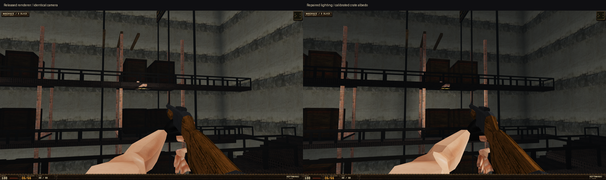
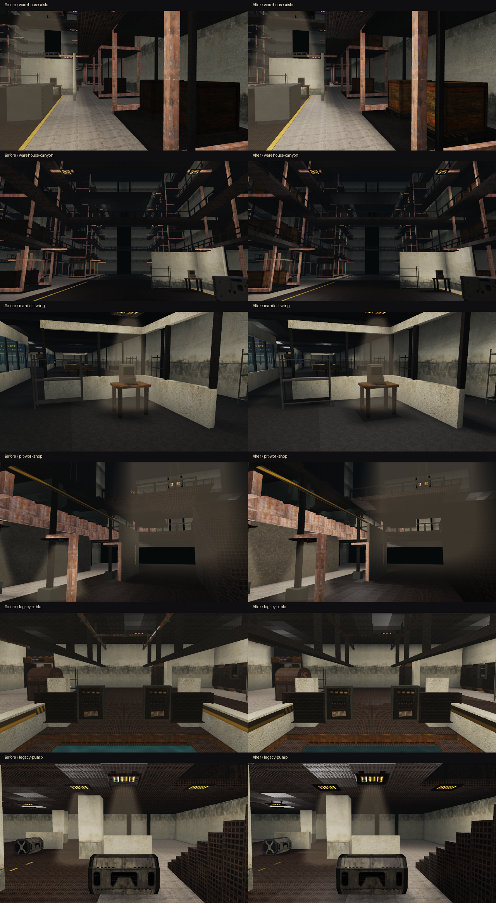
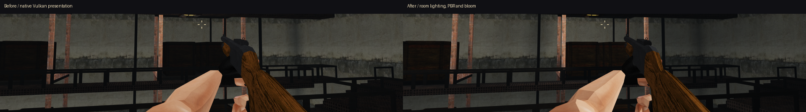

# Renderer lighting repair — v0.6.3

The renderer was already running Vulkan, normal maps, GGX dielectric shading
and linear HDR. The inputs to those systems still caused flat results: fixture
lights stopped at 5.48 metres, cached surface normals faced the initial camera,
and moving objects and the first-person rig used simplified fixed illumination.
The tall warehouse left many receivers outside every light's influence.

The repair expands fixture influence to 12 metres with a smooth falloff and
reduces uniform indoor ambient to expose the direct light. Static diffuse
visibility uses three complete queries per fixture, and the shared normal-light
selection uses visibility-tested receivers. Exhausting the budget does not
silently make an untested light visible. Moving objects are sampled without
adding their changing positions to the static lighting cache.

`World::lightRayClear` separates optical visibility from player clearance.
A balanced acceleration structure intersects static solids, oriented fixtures,
shelf plates and posts, real guardrail bars and door headers. Exact closed box
bounds prevent leaks along shared tile edges. Transparent windows and thin
floor decals do not cast opaque volume shadows. Terrain and shaped water beds
retain the volumetric reference trace. Geometry unload/reload clears the
visibility cache. Door leaves do not invalidate static map lighting.

Physical surface normals now travel with the tangent-space lighting data.
A controlled Vulkan regression loads a plane from behind and then views it
from the front: the original renderer gives a cached highlight of 0 versus a
fresh highlight of 58; the repair gives 58 in both cases. The warehouse also
matches a fresh renderer after the camera moves across the aisle: one pixel
exceeds a 4/255 channel difference at 128x72, with mean error 0.000543/255.

The viewmodel selects two visible room fixtures, shades each face and receives
material normal/specular response. Enemy and authored-actor faces use exterior
lighting probes. The supplied wooden crate atlas averages approximately 31/255
red; a 2.2 display-space albedo gain restores board detail before linear shading,
without increasing ambient or adding emission. The original embedded texture
is unchanged. The final HDR composite samples highlights at two pixels rather
than four and doubles the bloom contribution from 0.035 to 0.07. HUD and base
image remain unblurred. Hardware diagnostics explicitly report linear HDR/LDR.

## Visual evidence

The D Block baseline uses v0.6.2 renderer source with the new inspection camera
and regression instrumentation enabled. The twelve room baselines use the
published executable. The above are deterministic Vulkan headless surface captures. They bypass the
final bloom pass. Native 1920x1080 window captures additionally verified final
presentation; an unrelated always-on-top desktop popup covered part of those
captures. The crop below excludes that region and the HUD. Full desktop
captures are retained locally and are not included in the repository.

## Pixel comparisons

Same cameras, positions, geometry and resolution. A changed pixel has a maximum
RGB-channel difference greater than 4/255. Mean error is the mean absolute RGB
channel difference on the 0–255 scale. These metrics establish that the render
changed; they are not quality scores. Full results include the legacy areas.

| View | Changed pixels | Mean channel error |
| --- | ---: | ---: |
| bore-axis | 69.23% | 11.365 |
| coolant-depth | 73.34% | 17.857 |
| corridor-light | 72.45% | 18.377 |
| fixture-depth | 89.77% | 20.608 |
| fixture-shaft | 25.53% | 5.285 |
| intake-bay | 90.31% | 14.738 |
| legacy-cable | 70.85% | 11.408 |
| legacy-foundry | 80.25% | 20.167 |
| legacy-pump | 70.25% | 10.337 |
| legacy-waste | 77.67% | 9.804 |
| manifest-wing | 74.03% | 12.662 |
| pit-chassis | 73.03% | 18.871 |
| pit-workshop | 59.83% | 12.670 |
| platform-axis | 39.28% | 5.568 |
| warehouse-aisle | 73.17% | 13.409 |
| warehouse-canyon | 55.97% | 7.557 |
| warehouse-d-block | 73.08% | 12.012 |

## Validation and performance

Release build, Vulkan material/depth/clipping suite, smoke suite, mechanisms,
campaign traversal and world isolation all pass. Visibility regressions cover
open aisles, thin rack posts, adjacent open space, solid decks, and guardrail
gaps while movement collision still blocks the guardrail envelope.

The native 1920x1080 freight benchmark on an RTX 5060 Ti, linear HDR and 4x MSAA
measured 122.6–159.1 wall-clock FPS across eight fixed workloads, with zero static
map rebuilds during motion. This is a short local benchmark, not a general
hardware guarantee or a comparison against other games. The door benchmark
also records zero static map rebuilds through all six opening/closing cycles.
The more complete legacy static bake was reduced from roughly 1.32 seconds
with volumetric queries to 134 milliseconds with accelerated optical queries;
the original incomplete-budget bake took roughly 103 milliseconds. Static
rebuild cost is reported separately from warm-frame throughput.

[Hardware and optical regression report](renderer-lighting-repair/vulkan-test.txt),
[original renderer negative control](renderer-lighting-repair/original-renderer-regression.txt),
[freight performance](renderer-lighting-repair/freight-performance-window.txt),
[door performance](renderer-lighting-repair/door-performance-window.txt),
[release checks](renderer-lighting-repair/release-validation.txt).

All 166 embedded resources still pass exact lossless verification. The EXE is
21,976,576 bytes, below the 22,000,000-byte budget. No new maps or save-format
changes were made. The shipping script now uses the same 22 MB limit as the
build verifier.

## Remaining limits

The renderer still uses two selected material lights, baked static occlusion
and approximate indirect illumination. This patch does not implement screen-
space AO, reflection probes, dynamic world shadow maps or full global illumination.
Moving actors receive room light but do not update every cached architectural
shadow. Transparent batches remain unsorted. Warehouse repetition, composition
and environmental storytelling still require art work; pixel changes alone do
not establish parity with any other game.
